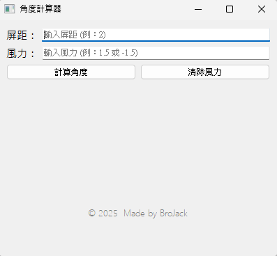
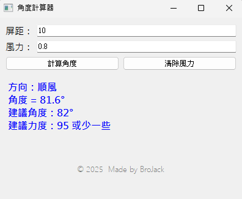

# DDT_Calculator
高拋計算機檔案位置: dist/angle_calculator.exe

   
  <strong>高拋計算機示意圖</strong>

屏距: 距離敵人多少屏(地圖上白色框框拖拉可以看)。
風力: 當前風力是多少。順風0.8，輸入:0.8;逆風0.8，則輸入:-0.8。
計算角度: 當輸入完屏距和風力後，按下按鍵即可計算高拋的角度。
清除風力: 讓讓使用者快速清除輸入的風力，不需要反白+DEL刪除數字。

範例:

   
  <strong>Example</strong>

假設:
距離敵人: 10屏
風力: 順風0.8

計算結果:
角度81.6，建議角度82
所以使用者角度=82，力度大概95 or 94，根據設定的角度(82)與實際角度(81.6)去微調力度
